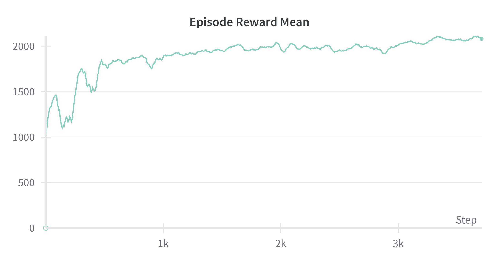

# Melting Pot 2023 Reinforcement Learning Approach - Team Marlshmallows

This repository contains the code I used to train an agent to play the allelopathic_harvest__open substrate for the Melting Pot competition. Some of the code is from the [baselines repository](https://github.com/rstrivedi/Melting-Pot-Contest-2023) provided at the start of the competition.

## Setup Guide

It's recommended to use Ubuntu 20.04. macOS users might run into installation errors. Follow these steps to set up the environment:

### Create Conda Environment

1. Create a Conda environment with Python 3.10:
`conda create -n train_env python=3.10.12`
2. Activate the newly created environment:
`conda activate train_env`

### Install Necessary Packages

1. Navigate to the project directory
`cd path/to/meltingpot-2023-trainer`
2. Install packages
`pip install -r requirements.txt`

## Setup Training Visualization & Monitoring

Before running the training script, you need to set up a tool for monitoring and visualizing the training process:

1. Create an account on the Weights & Biases website ([wandb.ai](https://wandb.ai)).
2. Obtain your API key from your account settings on the Weights & Biases website.
3. Set the API key as an environment variable in your terminal session where you will run the training script. Use the following command:
`export WANDB_API_KEY=<Your Key>`

## Run Training

To start training:

1. Open `train.py` and adjust the user settings at the top of the file. You might be able to increase num_workers if you have more CPUs and RAM.
2. Run the training script:
`python train.py`

The training will run infinitely until you ctrl+c in the terminal. It is configured to save the model checkpoint every 2 episodes. Only the last 500 checkpoints are kept.

## Watch Trained Agent Play

The checkpoint files should be located in output_dir/torch/al_harvest/PPO_meltingpot_x/checkpoint_x/policies/default_policy/. The content of the default_policy directory can be copied to the al_harvest_checkpoint/ directory in the [evaluation repo](https://github.com/benjamin-swain/meltingpot-2023-solution) for evaluation (you will need to complete the setup guide in the evaluation repo and set the substrate_to_policy in evaluate.py to TrainedPolicy before running evaluation).

## Future Work

This training framework could be improved by including more scenarios for the agents to train in. Currently the agent trains in a scenario consisting entirely of other focal agents who always plant red- there are no background agents who plant green or blue, so this leads to 
issues when the trained agent encounters green or blue planters in evaluation. However, this trained agent performs well on the allelopathic_harvest__open_2 scenario which consists of 14 focals and 2 background players.

The network architecture was somewhat limited by my compute- it's possible that modifying the architecture in config.py by adding more layers or increasing the size of existing layers will lead to higher agent scores.

Below shows the episode reward mean (using custom rewards defined in al_harvest_env.py) for 3700 episodes of training which took 81 hours on my machine.

